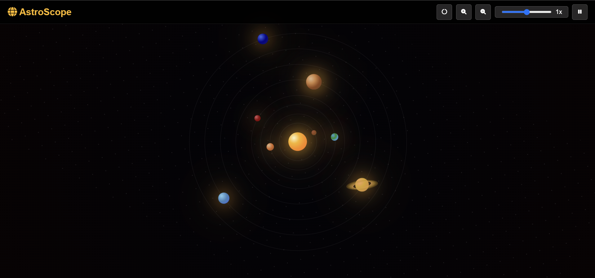

# AstroScope - Simulasi Tata Surya Interaktif



## 🌟 Deskripsi
AstroScope adalah simulasi tata surya interaktif yang dibangun dengan JavaScript murni. Aplikasi ini memvisualisasikan pergerakan planet-planet dalam tata surya dengan skala dan orbit yang proporsional, memberikan pengalaman pembelajaran astronomi yang menarik dan informatif.

## ✨ Fitur Utama
- **Simulasi Real-time**: Pergerakan planet yang akurat berdasarkan perhitungan orbital
- **Kontrol Interaktif**:
  - Zoom in/out untuk melihat detail planet
  - Pengaturan kecepatan simulasi
  - Toggle orbit planet
  - Pause/play simulasi
- **Informasi Detail Planet**:
  - Data fisik (diameter, massa, suhu)
  - Jarak dari matahari
  - Periode orbit
  - Perbandingan dengan Bumi
  - Fakta-fakta menarik
- **Tampilan Responsif**: Mendukung berbagai ukuran layar dan perangkat
- **Efek Visual**: Animasi planet, cincin Saturnus, dan efek atmosfer

## 🛠️ Teknologi
- HTML5
- CSS3
- JavaScript (Vanilla)
- Font Awesome untuk ikon
- Teknik CSS modern (Flexbox, Grid, Animations)

## 📱 Kompatibilitas
- Desktop (Chrome, Firefox, Safari, Edge)
- Mobile browsers
- Tablet devices

## 🚀 Cara Menggunakan
1. Clone repository:
   ```bash
   git clone https://github.com/raviel17/AstroScope.git
   ```
2. Buka file `index.html` di browser
3. Atau deploy ke web server

## 🎮 Kontrol
- **Zoom**: Tombol + dan - atau scroll mouse
- **Orbit**: Toggle tampilan orbit planet
- **Kecepatan**: Slider untuk mengatur kecepatan simulasi
- **Pause/Play**: Menghentikan atau melanjutkan simulasi
- **Info Planet**: Klik pada planet untuk melihat detail

## 🌍 Data Planet
Simulasi mencakup semua planet dalam tata surya:
- Matahari (pusat sistem)
- Merkurius
- Venus
- Bumi
- Mars
- Jupiter
- Saturnus (dengan sistem cincin)
- Uranus
- Neptunus

## 📊 Perhitungan Orbital
Simulasi menggunakan perhitungan orbital berdasarkan:
- Semi-major axis
- Eksentrisitas
- Inklinasi
- Mean longitude
- Mean motion

## 🎨 Fitur Visual
- Loading screen animatif
- Efek parallax bintang
- Animasi planet
- Efek glow dan atmosfer
- Sistem cincin Saturnus yang detail

## 🔧 Pengembangan
Untuk berkontribusi:
1. Fork repository
2. Buat branch fitur baru
3. Commit perubahan
4. Push ke branch
5. Buat Pull Request

## 🙏 Kredit
- Font Awesome untuk ikon
- Data orbital dari NASA
- Inspirasi desain dari berbagai simulasi tata surya

## 📞 Kontak
- GitHub: [@raviel17](https://github.com/raviel17)
- Email: raviel17@gmail.com

## 🐛 Pelaporan Bug
Silakan buat issue baru di GitHub repository untuk melaporkan bug atau menyarankan fitur baru.

---
⭐ Jangan lupa beri bintang jika Anda menyukai project ini!
